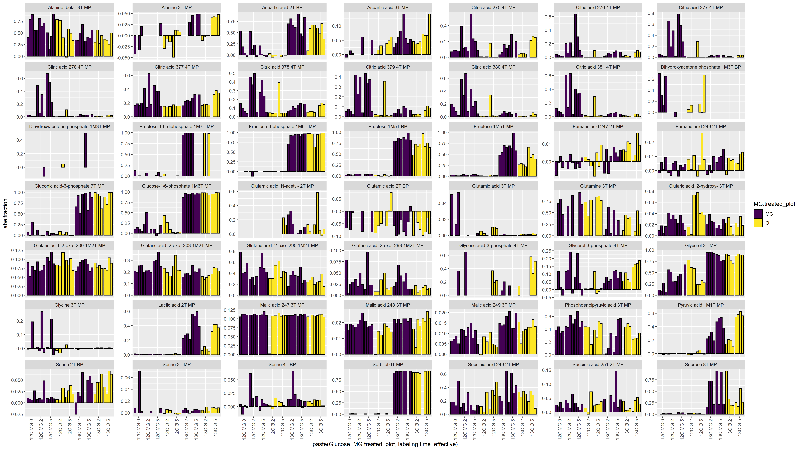

```{r setup, include=FALSE}
knitr::opts_chunk$set(echo = TRUE,fig.keep = TRUE,fig.path = "./Figures/",highlight = TRUE)

```

```{r packages, echo=FALSE}
library(tidyverse)
library(openxlsx)
#remotes::install_github("tidyverse/ggplot2")
#library(devtools)
#dev_mode(TRUE)
#library(ggplot2)
```


# load data

```{r load data}
df=read.csv("./outputfiles_20190914/labelincorporation_09-14-2019_19-57-09/DataMatrix.csv",stringsAsFactors = F)
df=gather(df,key="file",value = "labelfraction",-Metabolite,-QuantMasses)
df_sample_metadata=read.xlsx("../Sample_overview.xlsx",sheet = "Sample_overview",rows=1:37) #row 38:43=Testsamples
 df$sample_no=str_replace_all(df$file,".*_to_\\d{3}_(\\d{2})_.*","\\1") %>% 
    as.numeric()

df=left_join(df,df_sample_metadata,by=c("sample_no"="corrected.SampleNo.Fabiola"))
df=df %>% filter(sample_no!=24) #had a pipetting mistake
df$labeling.time_effective=ifelse(df$MG.treated,df$labeling.time-15,df$labeling.time)
df$Metabolite_short=str_replace_all(df$Metabolite,"(.*_[MB]P)_.*","\\1") %>% 
  str_replace_all(.,"MEOX","M") %>% 
  str_replace_all(.,"TMS","T") %>% 
  str_remove_all("[()]") %>% 
  str_replace_all(.,"_{1,}"," ")
df$MG.treated_plot=ifelse(df$MG.treated,"MG","Ø")
```

```{r plots}
filter_metabolites=c("Fructose-1-phosphate 1M6T MP")#,"Dihydroxyacetone phosphate 1M3T MP")

p=ggplot(df %>% filter(!Metabolite_short%in%filter_metabolites),aes(x=paste(Glucose,labeling.time_effective),y=labelfraction,fill=MG.treated_plot,group=file))+
  geom_col(position = position_dodge(),color="black")+
  scale_fill_viridis_d()+
  guides(x=guide_axis(angle=90))+
  facet_wrap(~Metabolite_short)

ggsave("Labelincorporation_barchart.pdf",plot=p,height = 12,width = 12*16/9)
ggsave("Labelincorporation_barchart.png",plot=p,height = 12,width = 12*16/9)

p=ggplot(df%>% filter(!Metabolite_short%in%filter_metabolites),aes(x=paste(Glucose,MG.treated_plot,labeling.time_effective),y=labelfraction,fill=MG.treated_plot,group=file))+
  geom_col(position = position_dodge(),color="black")+
  scale_fill_viridis_d()+
  scale_x_discrete(guide=guide_axis(angle = 90))+#(n.dodge=3))+
  facet_wrap(~Metabolite_short,scales = "free_y")

ggsave("Labelincorporation_barchart_free_y.pdf",plot=p,height = 12,width = 12*16/9)
ggsave("Labelincorporation_barchart_free_y.png",plot=p,height = 12,width = 12*16/9)

```

Label incoroporation with free y-axis is shown in 


[Labelincorporation_barchart_free_y.pdf](Labelincorporation_barchart_free_y.pdf)

Fructose shows difference, Pyruvate and Lactate as well.
Sorbitol, Citrate, Succinate, Fumarate and Malate have to be checked manually.