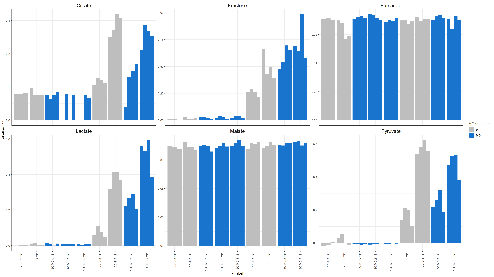
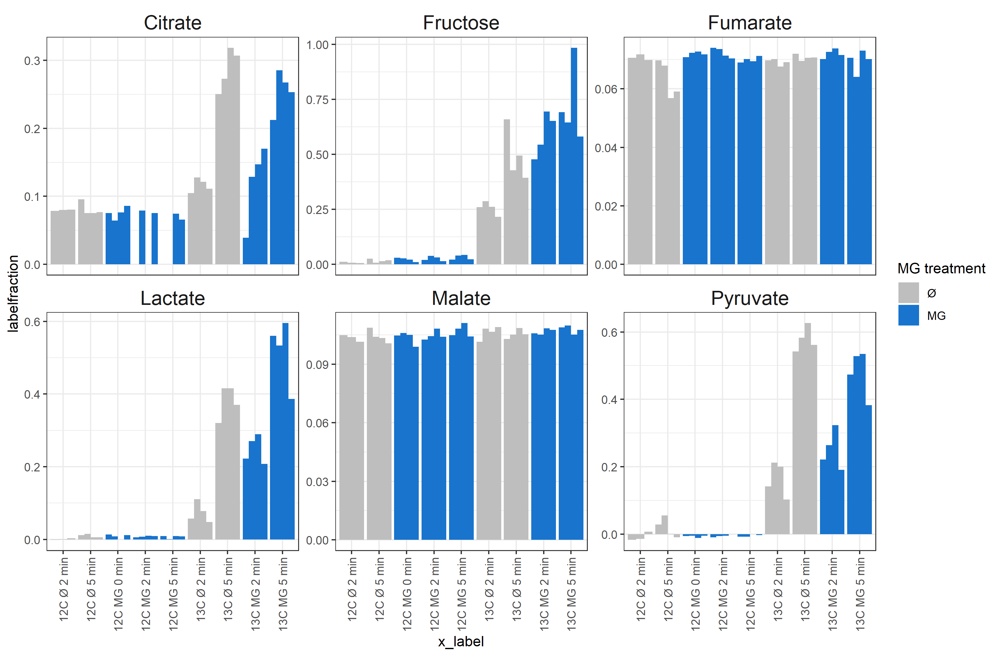

```{r setup, include=FALSE}
knitr::opts_chunk$set(echo = F,fig.keep = TRUE,fig.path = "./Figures/",highlight = TRUE)

```

```{r packages, include=FALSE}
library(tidyverse)
library(openxlsx)
#remotes::install_github("tidyverse/ggplot2")
#library(devtools)
#dev_mode(TRUE)
#library(ggplot2)
```

# Load Data

## from manual peak picking

```{r load data from manual annotation}
# get all files that end in ".unknown" in the directory specified above
file.list <- list.files(path = "./outputfiles_20191025_manual_label/",pattern='*.csv',full.names = T,recursive = F)
file.list <- setNames(file.list, basename(file.list)) #add bare file names as names for input file list

df_manual <- map_df(file.list, read.csv, .id = "file",comment.char="",stringsAsFactors=F) %>% 
  filter(str_detect(Name,"Unknown",negate = T)) %>% filter(str_detect(Name,"Sorbitol",negate = T)) %>% 
  filter(nchar(Quantification)>3)

df_manual=df_manual %>% mutate(light_heavy=str_replace_all(Quantification,".*(light|heavy).*","\\1"),
                 Name= str_remove(Name,"#") %>% str_replace_all("(.*)_\\d.*","\\1"))

df_manual_label=df_manual %>%  group_by(Name,file) %>%arrange(desc(light_heavy)) %>%
  mutate(QuantMasses=paste(Quant.Masses,collapse = "_")) %>%ungroup %>% 
  select(file,Name,Area,light_heavy,QuantMasses) %>% 
  pivot_wider(id_cols=c(file,Name,QuantMasses),names_from = light_heavy,values_from = Area ) %>%
  mutate(labelfraction=heavy/(light+heavy))

df_sample_metadata=read.xlsx("../Sample_overview.xlsx",sheet = "Sample_overview",rows=1:37) #row 38:43=Testsamples
 df_manual_label$sample_no=str_replace_all(df_manual_label$file,".*_to_\\d{3}_(\\d{2})_.*","\\1") %>% 
    as.numeric()

df_manual_label=left_join(df_manual_label,df_sample_metadata,by=c("sample_no"="corrected.SampleNo.Fabiola"))
df_manual_label=df_manual_label %>% filter(sample_no!=24) #had a pipetting mistake


df_manual_label$labeling.time_effective=
  ifelse(df_manual_label$MG.treated,df_manual_label$labeling.time-15,df_manual_label$labeling.time)
df_manual_label$Metabolite_short=paste(df_manual_label$Name,"manual")
df_manual_label$MG.treated_plot=ifelse(df_manual_label$MG.treated,"MG","Ø")
```


## from SILVIA annotation

```{r load data}
df=read.csv("./outputfiles_20190914_SILVIA//labelincorporation_09-14-2019_19-57-09/DataMatrix.csv",
            stringsAsFactors = F)
df=gather(df,key="file",value = "labelfraction",-Metabolite,-QuantMasses)
df_sample_metadata=read.xlsx("../Sample_overview.xlsx",sheet = "Sample_overview",rows=1:37) 
#row 38:43=Testsamples, so meta info not needed here
 df$sample_no=str_replace_all(df$file,".*_to_\\d{3}_(\\d{2})_.*","\\1") %>% 
    as.numeric()

df=left_join(df,df_sample_metadata,by=c("sample_no"="corrected.SampleNo.Fabiola"))
df=df %>% filter(sample_no!=24) #had a pipetting mistake


df$labeling.time_effective=ifelse(df$MG.treated,df$labeling.time-15,df$labeling.time)
df$Metabolite_short=str_replace_all(df$Metabolite,"(.*_[MB]P)_.*","\\1") %>% 
  str_replace_all("MEOX","M") %>% 
  str_replace_all("TMS","T") %>% 
  str_remove_all("[()]") %>% 
  str_replace_all("_{1,}"," ") %>% 
  str_replace_all("ic acid","ate")
df$MG.treated_plot=ifelse(df$MG.treated,"MG","Ø")
```

# Combine dataframes and filter selected metabolites

```{r combine dataframes filter metabolites}
keepcols=intersect(names(df),names(df_manual_label))
df=bind_rows(df[keepcols],df_manual_label[keepcols])

metabolites_keep=c('Pyruvate 1M1T MP','Lactate 2T MP','Succinate 249 2T MP','Fumarate 247 2T MP','Malate 247 3T MP','Citrate 275 4T MP','Fructose 1M5T MP','Succinate 251 2T MP','Fumarate 249 2T MP','Malate 248 3T MP','Malate 249 3T MP','Citrate manual','Fumarate manual','Malate manual','Succinate manual')

df=df %>% filter(Metabolite_short%in%metabolites_keep)

df$MG.treated_plot=factor(df$MG.treated_plot,levels = c("Ø","MG"),ordered = T)

df$x_label=factor(paste(df$Glucose,df$MG.treated_plot,df$labeling.time_effective,"min"),
levels=c('12C Ø 2 min','12C Ø 5 min',
         '12C MG 0 min','12C MG 2 min','12C MG 5 min',
         '13C Ø 2 min','13C Ø 5 min',
         '13C MG 2 min','13C MG 5 min'),ordered = T)

```

# Generate plots

## Overview

```{r plots, warning=FALSE}

p=ggplot(df,aes(x=x_label,
                y=labelfraction,fill=MG.treated_plot,group=file))+
  geom_col(position = position_dodge())+
  scale_fill_manual(values=c("Ø"="gray","MG"="dodgerblue3"),name="MG treatment")+
  scale_x_discrete(guide=guide_axis(angle = 90))+#(n.dodge=3))+
  facet_wrap(~Metabolite_short,scales = "free_y")+
  theme_bw()

ggsave("Labelincorporation_barchart_manual_free_y.pdf",plot=p,height = 12,width = 12*16/9)
ggsave("Labelincorporation_barchart_manual_free_y.png",plot=p,height = 12,width = 12*16/9)

```

Label incoroporation with free y-axis is shown in 


_See also pdf:_ [Labelincorporation_barchart_manual_free_y.pdf](Labelincorporation_barchart_manual_free_y.pdf)

Citrate looks much better than before. Now, where there were big outliers in 12C-samples, these values are rightfully missing (actually no citrate detected in measurement).  
Other TCA-intermediates show no real label incorporation, but are also much more consistent than before.

## Most interesting candidates

```{r plots for report, warning=FALSE}

metabolites_keep_report=c('Pyruvate 1M1T MP','Lactate 2T MP','Fructose 1M5T MP','Citrate manual')

p=ggplot(df %>% filter(Metabolite_short%in%metabolites_keep_report),
         aes(x=x_label,
             y=labelfraction,fill=MG.treated_plot,group=file))+
  geom_col(position = position_dodge())+
  scale_fill_manual(values=c("Ø"="gray","MG"="dodgerblue3"),name="MG treatment")+
  scale_x_discrete(guide=guide_axis(angle = 90))+#(n.dodge=3))+
  facet_wrap(~str_replace(Metabolite_short,"(.*?) .*","\\1"),scales = "free_y")+
  ylab("labelled fraction")+
  xlab("")+
  ggtitle("Labelincorporation in HeLa cells, MG treatment: 15 minutes", 
          subtitle = "each bar: 1 replicate")+
  theme_bw()+
  theme(strip.background = element_blank(),
        strip.text = element_text(size=15))

ggsave("Labelincorporation_report.pdf",plot=p,height = 7,width = 6*16/9)
ggsave("Labelincorporation_report.png",plot=p,height = 7,width = 6*16/9)

```

Label incoroporation with free y-axis is shown in 


_See also pdf:_ [Labelincorporation_report.pdf](Labelincorporation_report.pdf)

With MG treatment, label incorporation into Lactate and Fructose increases, in Pyruvate and Citrate it stays similar, (the delta between 2 and 5 minutes becomes smaller), in TCA cycle intermediates we see no label incorporation. This looks like, glycolysis is overall more active, but also polyol-pathway is more active.

