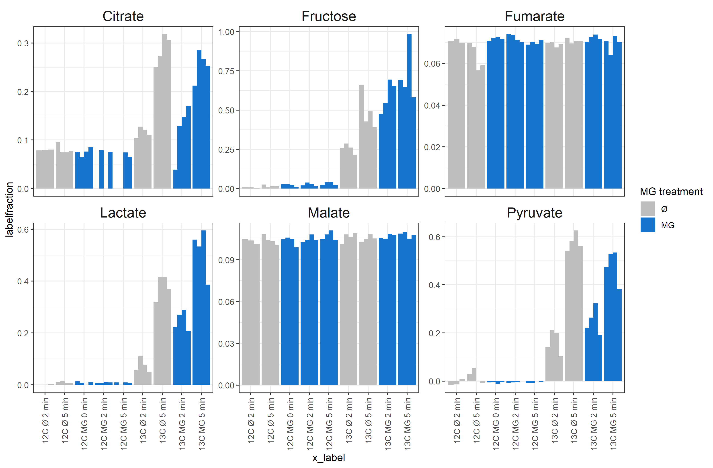

```{r setup, include=FALSE}
knitr::opts_chunk$set(echo = F,fig.keep = TRUE,fig.path = "./Figures/",highlight = TRUE)

```

```{r packages, include=FALSE}
library(tidyverse)
library(openxlsx)
library(cowplot)
#remotes::install_github("tidyverse/ggplot2")
#library(devtools)
#dev_mode(TRUE)
#library(ggplot2)
```

### Cinnamic Acid (internal Standard)

The general quantification of pool sizes is difficult in this sample set. Apperently deviations between samples were quite substantial during harvest, as the internal standard (Cinnamic acid) varies quite a bit. I tried to find possible biological reasons in the samples, but to no avail. I colored the bars by all possible influence factors I could think of, but there is no clear influence to be found. (see below) _Label incorporation however (especially after manual verification) still yields useful results, as this is calculated always relative within the sample._

```{r cinnamic acid, fig.height=6, fig.width=15, message=FALSE, warning=FALSE}
df_cinnamic=read.csv('./outputfiles_20190914_SILVIA/cinnamic_acid_09-14-2019_19-54-24/matrices/quantMassAreas_cinAcidNormMatrix.csv',stringsAsFactors = F)
df_sample_metadata=read.xlsx("../Sample_overview.xlsx",sheet = "Sample_overview",rows=1:37) #row 38:43=Testsamples

df_cinnamic=gather(df_cinnamic,key = "file",value = "AUC",-Metabolite,-QuantMasses)
df_cinnamic=df_cinnamic %>% mutate(
  injection_no=str_replace_all(file,".*_to_(\\d{3})_.*","\\1") %>% 
    as.numeric(),
  sample_no=str_replace_all(file,".*_to_\\d{3}_(\\d{2})_.*","\\1") %>% 
    as.numeric(),
  MG_treatment=ifelse(str_detect(file,"_MG_"),"MG","Ø"),
  Carbon=str_replace_all(file,".*_C(1[23])_.*","\\1C"),
  labelling_time=str_replace_all(file,".*_(\\d+min)_.*","\\1"),
  labelling_time_num=str_remove_all(labelling_time,"min") %>%
    as.numeric(),
  Replicate=str_replace_all(file,".*_(R\\d)..*","\\1"),
  Replicate_num=str_remove_all(Replicate,"R") %>% as.numeric()
)

df_cinnamic=left_join(df_cinnamic,df_sample_metadata %>%
                        select(corrected.SampleNo.Fabiola,
                               cellnumber.according.to.conditions,
                               derivatization.same.MeOX.as.Ident.and.Quant),
                      by=c("sample_no"="corrected.SampleNo.Fabiola"))

p=ggplot(df_cinnamic,aes(x=injection_no,y=AUC))+
  scale_fill_viridis_d()+
  scale_x_continuous(breaks = seq(0,65,5))+
  geom_hline(yintercept = mean(df_cinnamic$AUC,na.rm = T)+
               sd(df_cinnamic$AUC,na.rm = T),
             color="black",linetype="dashed") +
  geom_hline(yintercept = mean(df_cinnamic$AUC),color="black")+
  geom_hline(yintercept = mean(df_cinnamic$AUC,na.rm = T) -
              sd(df_cinnamic$AUC,na.rm = T),
             color="black",linetype="dashed")+
  ggtitle("Cinnamic Acid intensity")
pl1=p+geom_col(aes(fill=MG_treatment))
pl2=p+geom_col(aes(fill=Carbon))
pl3=p+geom_col(aes(fill=labelling_time))+scale_fill_viridis_d(name="labelling/\ntreatment\ntime")
pl4=p+geom_col(aes(fill=Replicate))
#p+geom_col(aes(fill=derivatization.same.MeOX.as.Ident.and.Quant))
pl5=ggplot(df_cinnamic,aes(x=injection_no,y=AUC))+
  scale_fill_viridis_c(name="sample\nnumber")+
   geom_hline(yintercept = mean(df_cinnamic$AUC,na.rm = T)+
               sd(df_cinnamic$AUC,na.rm = T),
             color="black",linetype="dashed") +
  geom_hline(yintercept = mean(df_cinnamic$AUC),color="black")+
  geom_hline(yintercept = mean(df_cinnamic$AUC,na.rm = T) -
              sd(df_cinnamic$AUC,na.rm = T),
             color="black",linetype="dashed")+
  geom_col(aes(fill=sample_no))+
  ggtitle("Cinnamic Acid intensity")

pl6=ggplot(df_cinnamic,aes(x=injection_no,y=AUC))+
  scale_fill_viridis_c(name="cellnumber\nmatched by\n treatment\nconditions")+
   geom_hline(yintercept = mean(df_cinnamic$AUC,na.rm = T)+
               sd(df_cinnamic$AUC,na.rm = T),
             color="black",linetype="dashed") +
  geom_hline(yintercept = mean(df_cinnamic$AUC),color="black")+
  geom_hline(yintercept = mean(df_cinnamic$AUC,na.rm = T) -
              sd(df_cinnamic$AUC,na.rm = T),
             color="black",linetype="dashed")+
  geom_col(aes(fill=cellnumber.according.to.conditions))+
  ggtitle("Cinnamic Acid intensity")

allplots=lapply(1:6, FUN=function(x){get(paste0("pl",x))})
pall=plot_grid(plotlist = allplots,axis = "tlbr",align = "hv",nrow = 2,labels = "AUTO")

ggsave("Cinnamic_Acid_report.pdf",plot=pall,height = 7,width = 6*16/9)
ggsave("Cinnamic_Acid_report.png",plot=pall,height = 7,width = 6*16/9)
```


Cinnamic acid intensities are shown in 


_See also pdf:_ [Cinnamic_Acid_report.pdf](Cinnamic_Acid_report.pdf)

### Label incorporation


```{r load data from manual annotation}
# get all files that end in ".unknown" in the directory specified above
file.list <- list.files(path = "./outputfiles_20191025_manual_label/",pattern='*.csv',full.names = T,recursive = F)
file.list <- setNames(file.list, basename(file.list)) #add bare file names as names for input file list

df_manual <- map_df(file.list, read.csv, .id = "file",comment.char="",stringsAsFactors=F) %>% 
  filter(str_detect(Name,"Unknown",negate = T)) %>% filter(str_detect(Name,"Sorbitol",negate = T)) %>% 
  filter(nchar(Quantification)>3)

df_manual=df_manual %>% mutate(light_heavy=str_replace_all(Quantification,".*(light|heavy).*","\\1"),
                 Name= str_remove(Name,"#") %>% str_replace_all("(.*)_\\d.*","\\1"))

df_manual_label=df_manual %>%  group_by(Name,file) %>%arrange(desc(light_heavy)) %>%
  mutate(QuantMasses=paste(Quant.Masses,collapse = "_")) %>%ungroup %>% 
  select(file,Name,Area,light_heavy,QuantMasses) %>% 
  pivot_wider(id_cols=c(file,Name,QuantMasses),names_from = light_heavy,values_from = Area ) %>%
  mutate(labelfraction=heavy/(light+heavy))

df_sample_metadata=read.xlsx("../Sample_overview.xlsx",sheet = "Sample_overview",rows=1:37) #row 38:43=Testsamples
 df_manual_label$sample_no=str_replace_all(df_manual_label$file,".*_to_\\d{3}_(\\d{2})_.*","\\1") %>% 
    as.numeric()

df_manual_label=left_join(df_manual_label,df_sample_metadata,by=c("sample_no"="corrected.SampleNo.Fabiola"))
df_manual_label=df_manual_label %>% filter(sample_no!=24) #had a pipetting mistake


df_manual_label$labeling.time_effective=
  ifelse(df_manual_label$MG.treated,df_manual_label$labeling.time-15,df_manual_label$labeling.time)
df_manual_label$Metabolite_short=paste(df_manual_label$Name,"manual")
df_manual_label$MG.treated_plot=ifelse(df_manual_label$MG.treated,"MG","Ø")
```


```{r load data}
df=read.csv("./outputfiles_20190914_SILVIA//labelincorporation_09-14-2019_19-57-09/DataMatrix.csv",
            stringsAsFactors = F)
df=gather(df,key="file",value = "labelfraction",-Metabolite,-QuantMasses)
df_sample_metadata=read.xlsx("../Sample_overview.xlsx",sheet = "Sample_overview",rows=1:37) 
#row 38:43=Testsamples, so meta info not needed here
 df$sample_no=str_replace_all(df$file,".*_to_\\d{3}_(\\d{2})_.*","\\1") %>% 
    as.numeric()

df=left_join(df,df_sample_metadata,by=c("sample_no"="corrected.SampleNo.Fabiola"))
df=df %>% filter(sample_no!=24) #had a pipetting mistake


df$labeling.time_effective=ifelse(df$MG.treated,df$labeling.time-15,df$labeling.time)
df$Metabolite_short=str_replace_all(df$Metabolite,"(.*_[MB]P)_.*","\\1") %>% 
  str_replace_all("MEOX","M") %>% 
  str_replace_all("TMS","T") %>% 
  str_remove_all("[()]") %>% 
  str_replace_all("_{1,}"," ") %>% 
  str_replace_all("ic acid","ate")
df$MG.treated_plot=ifelse(df$MG.treated,"MG","Ø")
```


```{r combine dataframes filter metabolites}
keepcols=intersect(names(df),names(df_manual_label))
df=bind_rows(df[keepcols],df_manual_label[keepcols])

metabolites_keep=c('Pyruvate 1M1T MP','Lactate 2T MP','Fructose 1M5T MP','Citrate manual','Fumarate manual','Malate manual')

df=df %>% filter(Metabolite_short%in%metabolites_keep)

df$MG.treated_plot=factor(df$MG.treated_plot,levels = c("Ø","MG"),ordered = T)

df$x_label=factor(paste(df$Glucose,df$MG.treated_plot,df$labeling.time_effective,"min"),
levels=c('12C Ø 2 min','12C Ø 5 min',
         '12C MG 0 min','12C MG 2 min','12C MG 5 min',
         '13C Ø 2 min','13C Ø 5 min',
         '13C MG 2 min','13C MG 5 min'),ordered = T)

```


```{r plots, warning=FALSE}

p=ggplot(df,aes(x=x_label,
                y=labelfraction,fill=MG.treated_plot,group=file))+
  geom_col(position = position_dodge())+
  scale_fill_manual(values=c("Ø"="gray","MG"="dodgerblue3"),name="MG treatment")+
  scale_x_discrete(guide=guide_axis(angle = 90))+#(n.dodge=3))+
  facet_wrap(~str_replace(Metabolite_short,"(.*?) .*","\\1"),scales = "free_y")+
  theme_bw()+
  theme(strip.background = element_blank(),
        strip.text = element_text(size=15))

ggsave("Labelincorporation_report.pdf",plot=p,height = 7,width = 6*16/9)
ggsave("Labelincorporation_report.png",plot=p,height = 7,width = 6*16/9)

```

Label incoroporation with free y-axis is shown in 


_See also pdf:_ [Labelincorporation_report.pdf](Labelincorporation_report.pdf)

With MG treatment, label incorporation into Lactate and Fructose increases, in Pyruvate and Citrate it stays similar, (the delta between 2 and 5 minutes becomes smaller), in TCA cycle intermediates we see no label incorporation at all. This looks like, glycolysis is overall more active, but also polyol-pathway is more active.


